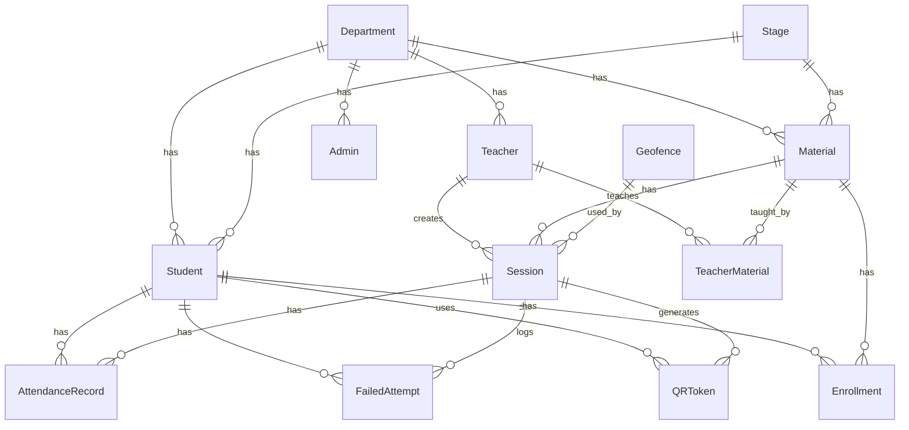

# 🗄️ توثيق قاعدة البيانات (Database Documentation)

## 📊 نظرة عامة

يستخدم النظام **PostgreSQL** كقاعدة بيانات علائقية مع **Prisma ORM** لإدارة البيانات.

---

## 📐 مخطط العلاقات (ERD)



---

## 📋 النماذج (Models)

### 🏢 Department (الأقسام)

قسم أكاديمي في الكلية.

| الحقل | النوع | الوصف |
|------|------|-------|
| `id` | BigInt | المعرف الفريد |
| `name` | String | اسم القسم (فريد) |
| `created_at` | DateTime | تاريخ الإنشاء |
| `updated_at` | DateTime | تاريخ التحديث |

**العلاقات:**
- `students` → Student[]
- `teachers` → Teacher[]
- `materials` → Material[]
- `admins` → Admin[]
- `promotion_config` → PromotionConfig?

---

### 📊 Stage (المراحل)

المرحلة الدراسية (السنة الأولى، الثانية، إلخ).

| الحقل | النوع | الوصف |
|------|------|-------|
| `id` | BigInt | المعرف الفريد |
| `name` | String | اسم المرحلة |
| `level` | Int | رقم المستوى (فريد) |
| `created_at` | DateTime | تاريخ الإنشاء |
| `updated_at` | DateTime | تاريخ التحديث |

**العلاقات:**
- `students` → Student[]
- `materials` → Material[]
- `promotions_from` → PromotionRecord[]
- `promotions_to` → PromotionRecord[]

---

### 👤 Student (الطلاب)

بيانات الطالب.

| الحقل | النوع | الوصف |
|------|------|-------|
| `id` | BigInt | المعرف الفريد |
| `student_id` | String | الرقم الجامعي (فريد) |
| `name` | String | الاسم الكامل |
| `email` | String | البريد الإلكتروني (فريد) |
| `password` | String | كلمة المرور (مشفرة) |
| `must_change_password` | Boolean | يجب تغيير كلمة المرور |
| `is_verified` | Boolean | تم التحقق من البريد |
| `fingerprint_hash` | String? | بصمة الجهاز |
| `academic_status` | Enum | الحالة الأكاديمية |
| `academic_year` | String? | السنة الدراسية |
| `department_id` | BigInt? | معرف القسم |
| `stage_id` | BigInt? | معرف المرحلة |

**حقول التحقق من البريد:**
- `email_verification_token`
- `email_verification_expires`
- `password_reset_token`
- `password_reset_expires`
- `email_verified_at`

**الفهارس:**
```prisma
@@index([department_id, stage_id])
@@index([email])
@@index([student_id])
@@index([email_verification_token])
@@index([password_reset_token])
```

---

### 👨‍🏫 Teacher (الأساتذة)

بيانات الأستاذ.

| الحقل | النوع | الوصف |
|------|------|-------|
| `id` | BigInt | المعرف الفريد |
| `name` | String | الاسم الكامل |
| `email` | String | البريد الإلكتروني (فريد) |
| `password` | String | كلمة المرور (مشفرة) |
| `department_id` | BigInt? | معرف القسم |
| `created_at` | DateTime | تاريخ الإنشاء |
| `updated_at` | DateTime | تاريخ التحديث |

**العلاقات:**
- `department` → Department?
- `sessions` → Session[]
- `teacher_materials` → TeacherMaterial[]

---

### 🔐 Admin (المديرون)

بيانات المدير.

| الحقل | النوع | الوصف |
|------|------|-------|
| `id` | BigInt | المعرف الفريد |
| `name` | String | الاسم الكامل |
| `email` | String | البريد الإلكتروني (فريد) |
| `password` | String | كلمة المرور (مشفرة) |
| `department_id` | BigInt? | معرف القسم (NULL = عميد) |

**ملاحظة:** إذا كان `department_id = NULL` فالمدير عميد (صلاحيات كاملة)

---

### 📚 Material (المواد)

المادة الدراسية.

| الحقل | النوع | الوصف |
|------|------|-------|
| `id` | BigInt | المعرف الفريد |
| `name` | String | اسم المادة |
| `department_id` | BigInt | معرف القسم |
| `stage_id` | BigInt | معرف المرحلة |
| `semester` | Enum | الفصل الدراسي |
| `is_core_subject` | Boolean | مادة أساسية؟ |
| `prerequisites` | String? | المتطلبات (JSON) |

**قيد التفرد:**
```prisma
@@unique([name, department_id, stage_id])
```

---

### 📍 Geofence (المواقع الجغرافية)

منطقة جغرافية محددة للتحقق من موقع الطالب.

| الحقل | النوع | الوصف |
|------|------|-------|
| `id` | BigInt | المعرف الفريد |
| `name` | String | اسم الموقع (فريد) |
| `latitude` | Float | خط العرض |
| `longitude` | Float | خط الطول |
| `radius_meters` | Int | نصف القطر (متر) |

---

### 📅 Session (الجلسات)

جلسة حضور.

| الحقل | النوع | الوصف |
|------|------|-------|
| `id` | BigInt | المعرف الفريد |
| `session_date` | DateTime | تاريخ الجلسة |
| `qr_secret` | String | مفتاح QR السري |
| `is_active` | Boolean | الجلسة نشطة؟ |
| `created_at` | DateTime | تاريخ الإنشاء |
| `expires_at` | DateTime | تاريخ الانتهاء |
| `teacher_id` | BigInt | معرف الأستاذ |
| `material_id` | BigInt | معرف المادة |
| `geofence_id` | BigInt | معرف الموقع |

**الفهارس:**
```prisma
@@index([teacher_id])
@@index([material_id])
@@index([geofence_id])
@@index([session_date])
@@index([is_active])
```

---

### 📱 QRToken (رموز QR)

رمز QR مؤقت.

| الحقل | النوع | الوصف |
|------|------|-------|
| `id` | BigInt | المعرف الفريد |
| `token_hash` | String | hash الرمز (فريد) |
| `generated_at` | DateTime | تاريخ التوليد |
| `expires_at` | DateTime | تاريخ الانتهاء |
| `used_at` | DateTime? | تاريخ الاستخدام |
| `session_id` | BigInt | معرف الجلسة |
| `used_by_student_id` | BigInt? | معرف الطالب المستخدم |

**ملاحظة:** صلاحية الرمز 30 ثانية فقط

---

### ✅ AttendanceRecord (سجلات الحضور)

سجل حضور طالب.

| الحقل | النوع | الوصف |
|------|------|-------|
| `id` | BigInt | المعرف الفريد |
| `token_hash` | String? | hash الرمز المستخدم |
| `latitude` | Float? | خط العرض |
| `longitude` | Float? | خط الطول |
| `marked_by` | String | طريقة التسجيل |
| `status` | Enum | حالة الحضور |
| `marked_at` | DateTime | وقت التسجيل |
| `session_id` | BigInt | معرف الجلسة |
| `student_id` | BigInt | معرف الطالب |

**قيد التفرد:**
```prisma
@@unique([student_id, session_id])
```

**حالات الحضور (AttendanceStatus):**
- `PRESENT` - حاضر
- `ABSENT` - غائب
- `LATE` - متأخر
- `EXCUSED` - معذور

---

### ❌ FailedAttempt (المحاولات الفاشلة)

تسجيل محاولات الحضور الفاشلة.

| الحقل | النوع | الوصف |
|------|------|-------|
| `id` | BigInt | المعرف الفريد |
| `error_type` | String | نوع الخطأ |
| `error_message` | String? | رسالة الخطأ |
| `ip_address` | String? | عنوان IP |
| `device_info` | String? | معلومات الجهاز |
| `fingerprint_hash` | String? | بصمة الجهاز |
| `attempted_at` | DateTime | وقت المحاولة |
| `session_id` | BigInt? | معرف الجلسة |
| `student_id` | BigInt? | معرف الطالب |

**أنواع الأخطاء:**
- `EXPIRED_QR` - QR منتهي الصلاحية
- `ALREADY_USED` - QR مستخدم مسبقاً
- `OUTSIDE_GEOFENCE` - خارج النطاق الجغرافي
- `UNAUTHORIZED_STUDENT` - طالب غير مسجل بالمادة
- `SESSION_NOT_ACTIVE` - الجلسة غير نشطة

---

## 🎓 نماذج نظام الترحيل

### Enrollment (التسجيل)

تسجيل طالب في مادة.

| الحقل | النوع | الوصف |
|------|------|-------|
| `id` | BigInt | المعرف الفريد |
| `academic_year` | String | السنة الدراسية |
| `result_status` | Enum | حالة النتيجة |
| `is_carried` | Boolean | مادة محمّلة؟ |
| `student_id` | BigInt | معرف الطالب |
| `material_id` | BigInt | معرف المادة |

**حالات النتيجة (SubjectResultStatus):**
- `PASSED` - ناجح
- `FAILED` - راسب
- `BLOCKED_BY_ABSENCE` - محروم بالغياب
- `IN_PROGRESS` - مستمر

---

### PromotionRecord (سجل الترحيل)

سجل ترحيل طالب بين المراحل.

| الحقل | النوع | الوصف |
|------|------|-------|
| `id` | BigInt | المعرف الفريد |
| `academic_year_from` | String | السنة المنقول منها |
| `academic_year_to` | String | السنة المنقول إليها |
| `decision` | Enum | قرار الترحيل |
| `failed_count` | Int | عدد المواد الراسبة |
| `carried_count` | Int | عدد المواد المحمّلة |
| `notes` | String? | ملاحظات |
| `processed_at` | DateTime | تاريخ التنفيذ |
| `processed_by` | String? | المنفذ |

**قرارات الترحيل (PromotionDecision):**
- `PROMOTED` - ترقية
- `PROMOTED_WITH_CARRY` - ترقية مع تحميل
- `REPEAT_YEAR` - إعادة السنة

---

### PromotionConfig (إعدادات الترحيل)

إعدادات الترحيل لكل قسم.

| الحقل | النوع | الوصف |
|------|------|-------|
| `max_carry_subjects` | Int | أقصى عدد للمواد المحمّلة |
| `fail_threshold_for_repeat` | Int | عتبة الرسوب للإعادة |
| `disable_carry_for_final_year` | Boolean | منع التحميل للسنة الأخيرة |
| `block_carry_for_core` | Boolean | منع تحميل المواد الأساسية |
| `repeat_mode` | String | نمط الإعادة |
| `department_id` | BigInt | معرف القسم (فريد) |

---

## 🔧 أوامر Prisma

```bash
# توليد العميل
npx prisma generate

# تشغيل migrations
npx prisma migrate dev

# مزامنة قاعدة البيانات
npx prisma db push

# فتح Studio
npx prisma studio

# إعادة تعيين قاعدة البيانات
npx prisma migrate reset
```

---

## 📊 الفهارس (Indexes)

تم إضافة فهارس لتحسين الأداء على:

| النموذج | الحقول |
|---------|--------|
| Student | department_id, stage_id, email, student_id |
| Teacher | department_id, email |
| Session | teacher_id, material_id, session_date, is_active |
| AttendanceRecord | session_id, student_id, marked_at, status |
| FailedAttempt | session_id, student_id, attempted_at, error_type |
| QRToken | session_id, used_by_student_id, expires_at |
