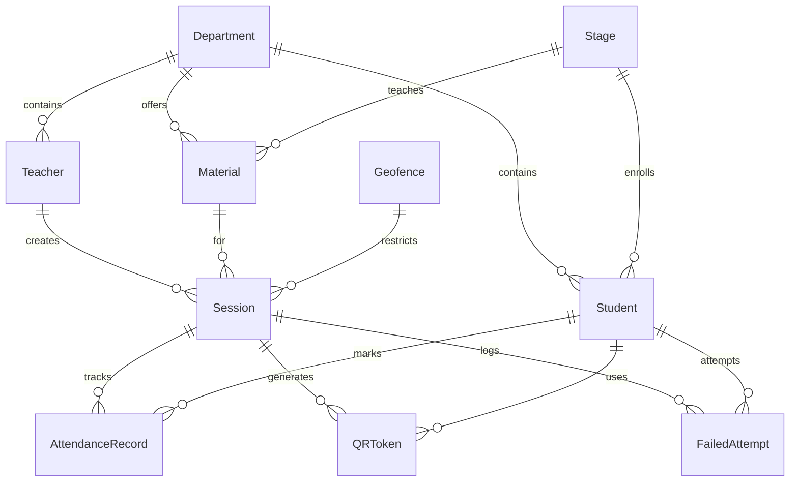

# Database Schema Documentation

**Project**: Privacy-Preserving Student Attendance System  
**Database**: PostgreSQL  
**ORM**: Prisma  
**Author**: [Your Name]  
**Date**: January 2026

---

## Overview

I designed a comprehensive database schema to support my Privacy-Preserving Student Attendance System. The schema consists of 10 interconnected models that handle user management, attendance tracking, and security features.

### Design Principles

1. **Normalization**: I normalized the database to 3NF to eliminate redundancy
2. **Referential Integrity**: All foreign keys have appropriate cascade/set null behaviors
3. **Indexing Strategy**: I added indexes on frequently queried fields
4. **Privacy**: Sensitive data (fingerprints) are hashed before storage
5. **Audit Trail**: Timestamps track creation and updates

---

## Entity Relationship Diagram



---

## Models Documentation

### 1. Department

**Purpose**: Represents academic departments (e.g., Computer Science, Mathematics)

**Schema**:
```prisma
model Department {
  id         BigInt   @id @default(autoincrement())
  name       String   @unique
  created_at DateTime @default(now())
  updated_at DateTime @updatedAt

  students  Student[]
  teachers  Teacher[]
  materials Material[]
}
```

**Design Decisions**:
- `name` is unique to prevent duplicate departments
- Soft relationships with students/teachers (SetNull on delete)
- Cascade delete for materials (department-specific)

**Indexes**:
- Primary key on `id`
- Unique constraint on `name`

---

### 2. Stage

**Purpose**: Represents academic levels/years (e.g., Year 1, Year 2)

**Schema**:
```prisma
model Stage {
  id         BigInt   @id @default(autoincrement())
  name       String
  level      Int      @unique
  created_at DateTime @default(now())
  updated_at DateTime @updatedAt

  students  Student[]
  materials Material[]
}
```

**Design Decisions**:
- `level` is unique to maintain ordered progression
- Allows flexible naming while ensuring unique levels
- Independent of departments for flexibility

**Indexes**:
- Primary key on `id`
- Unique constraint on `level`

---

### 3. Student

**Purpose**: Core entity representing students in the system

**Schema**:
```prisma
model Student {
  id                   BigInt   @id @default(autoincrement())
  student_id           String   @unique
  name                 String
  email                String   @unique
  password             String
  must_change_password Boolean  @default(true)
  is_verified          Boolean  @default(false)
  fingerprint_hash     String?
  created_at           DateTime @default(now())
  updated_at           DateTime @updatedAt

  department_id BigInt?
  department    Department? @relation(fields: [department_id], references: [id], onDelete: SetNull)

  stage_id BigInt?
  stage    Stage?  @relation(fields: [stage_id], references: [id], onDelete: SetNull)

  attendance_records AttendanceRecord[]
  qr_tokens          QRToken[]
  failed_attempts    FailedAttempt[]

  @@index([department_id])
  @@index([stage_id])
  @@index([email])
}
```

**Design Decisions**:
- **student_id**: Unique identifier separate from database ID (e.g., university ID)
- **fingerprint_hash**: SHA-256 hash for privacy-preserving device binding
- **must_change_password**: Forces password change on first login
- **is_verified**: Future feature for email verification
- **Optional department/stage**: Allows unassigned students

**Security Features**:
- Password stored as bcrypt hash
- Fingerprint stored as SHA-256 hash
- Email indexed for fast login queries

**Indexes**:
- Primary key on `id`
- Unique on `student_id` and `email`
- Index on `department_id`, `stage_id`, `email`

---

### 4. Teacher

**Purpose**: Represents teaching staff who create attendance sessions

**Schema**:
```prisma
model Teacher {
  id         BigInt   @id @default(autoincrement())
  name       String
  email      String   @unique
  password   String
  created_at DateTime @default(now())
  updated_at DateTime @updatedAt

  department_id BigInt?
  department    Department? @relation(fields: [department_id], references: [id], onDelete: SetNull)

  sessions Session[]

  @@index([department_id])
  @@index([email])
}
```

**Design Decisions**:
- Simpler than Student (no fingerprint requirement)
- Optional department assignment
- One-to-many with sessions

**Indexes**:
- Primary key on `id`
- Unique on `email`
- Index on `department_id`, `email`

---

### 5. Admin

**Purpose**: System administrators with full access

**Schema**:
```prisma
model Admin {
  id         BigInt   @id @default(autoincrement())
  name       String
  email      String   @unique
  password   String
  created_at DateTime @default(now())
  updated_at DateTime @updatedAt

  @@index([email])
}
```

**Design Decisions**:
- Minimal fields for security
- No relationships (administrative role)
- Email indexed for login performance

---

### 6. Material

**Purpose**: Represents courses/subjects taught

**Schema**:
```prisma
model Material {
  id         BigInt   @id @default(autoincrement())
  name       String
  created_at DateTime @default(now())
  updated_at DateTime @updatedAt

  department_id BigInt
  department    Department @relation(fields: [department_id], references: [id], onDelete: Cascade)

  stage_id BigInt
  stage    Stage  @relation(fields: [stage_id], references: [id], onDelete: Cascade)

  sessions Session[]

  @@unique([name, department_id, stage_id])
  @@index([department_id])
  @@index([stage_id])
}
```

**Design Decisions**:
- Unique combination of (name, department, stage)
- Allows same course name in different departments/stages
- Cascade delete when department/stage deleted

**Indexes**:
- Primary key on `id`
- Composite unique on `[name, department_id, stage_id]`
- Index on `department_id`, `stage_id`

---

### 7. Geofence

**Purpose**: Defines allowed locations for attendance marking

**Schema**:
```prisma
model Geofence {
  id            BigInt   @id @default(autoincrement())
  name          String   @unique
  latitude      Float
  longitude     Float
  radius_meters Int      @default(100)
  created_at    DateTime @default(now())
  updated_at    DateTime @updatedAt

  sessions Session[]
}
```

**Design Decisions**:
- Stores center point (lat/long) and radius
- Default 100m radius for classroom accuracy
- Reusable across multiple sessions
- Named for easy identification

**Usage**:
- Teacher selects geofence when creating session
- System validates student location during attendance

---

### 8. Session

**Purpose**: Represents an attendance session (class meeting)

**Schema**:
```prisma
model Session {
  id           BigInt   @id @default(autoincrement())
  session_date DateTime @default(now())
  qr_secret    String
  is_active    Boolean  @default(true)
  created_at   DateTime @default(now())
  expires_at   DateTime

  teacher_id BigInt
  teacher    Teacher @relation(fields: [teacher_id], references: [id], onDelete: Cascade)

  material_id BigInt
  material    Material @relation(fields: [material_id], references: [id], onDelete: Cascade)

  geofence_id BigInt
  geofence    Geofence @relation(fields: [geofence_id], references: [id], onDelete: Restrict)

  qr_tokens          QRToken[]
  attendance_records AttendanceRecord[]
  failed_attempts    FailedAttempt[]

  @@index([teacher_id])
  @@index([material_id])
  @@index([geofence_id])
  @@index([session_date])
  @@index([is_active])
}
```

**Design Decisions**:
- **qr_secret**: Secret key for generating QR codes
- **is_active**: Allows teacher to close session
- **expires_at**: Automatic session expiration
- **Restrict on geofence**: Prevents accidental geofence deletion

**Indexes**:
- Indexed on `is_active` for filtering active sessions
- Indexed on `session_date` for date-range queries

---

### 9. QRToken

**Purpose**: Tracks generated QR codes and their usage

**Schema**:
```prisma
model QRToken {
  id           BigInt    @id @default(autoincrement())
  token_hash   String    @unique
  generated_at DateTime  @default(now())
  expires_at   DateTime
  used_at      DateTime?

  session_id BigInt
  session    Session @relation(fields: [session_id], references: [id], onDelete: Cascade)

  used_by_student_id BigInt?
  used_by_student    Student? @relation(fields: [used_by_student_id], references: [id], onDelete: SetNull)

  @@index([session_id])
  @@index([used_by_student_id])
  @@index([expires_at])
}
```

**Design Decisions**:
- **token_hash**: Hashed QR code value (not plaintext)
- **used_at**: Tracks when token was used (null = unused)
- **expires_at**: Time-limited tokens for security
- **Optional student**: Tracks who used the token

**Security**:
- Tokens expire after short duration
- One-time use (tracked via `used_at`)
- Hashed storage prevents replay attacks

---

### 10. AttendanceRecord

**Purpose**: Records student attendance for sessions

**Schema**:
```prisma
model AttendanceRecord {
  id         BigInt   @id @default(autoincrement())
  token_hash String
  latitude   Float?
  longitude  Float?
  marked_by  String   @default("qr_scan")
  marked_at  DateTime @default(now())

  session_id BigInt
  session    Session @relation(fields: [session_id], references: [id], onDelete: Cascade)

  student_id BigInt
  student    Student @relation(fields: [student_id], references: [id], onDelete: Cascade)

  @@unique([student_id, session_id])
  @@index([session_id])
  @@index([marked_at])
}
```

**Design Decisions**:
- **Unique constraint**: One attendance per student per session
- **token_hash**: Links to QR code used
- **latitude/longitude**: Optional location verification
- **marked_by**: Tracks attendance method (future: manual, proxy, etc.)

**Privacy**:
- Location data optional
- Stored only if geofence validation required

---

### 11. FailedAttempt

**Purpose**: Security audit log for failed operations

**Schema**:
```prisma
model FailedAttempt {
  id               BigInt   @id @default(autoincrement())
  error_type       String
  error_message    String?
  ip_address       String?
  device_info      String?
  fingerprint_hash String?
  attempted_at     DateTime @default(now())

  session_id BigInt?
  session    Session? @relation(fields: [session_id], references: [id], onDelete: SetNull)

  student_id BigInt?
  student    Student? @relation(fields: [student_id], references: [id], onDelete: SetNull)

  @@index([session_id])
  @@index([student_id])
  @@index([attempted_at])
  @@index([error_type])
}
```

**Design Decisions**:
- Logs all failed authentication/attendance attempts
- Stores context (IP, device, fingerprint)
- Optional student/session links
- Indexed by error_type for analytics

**Use Cases**:
- Security monitoring
- Suspicious activity detection
- User support
- System analytics

---

## Relationships Summary

### One-to-Many Relationships
- Department → Students
- Department → Teachers
- Department → Materials
- Stage → Students
- Stage → Materials
- Teacher → Sessions
- Material → Sessions
- Geofence → Sessions
- Session → QRTokens
- Session → AttendanceRecords
- Session → FailedAttempts
- Student → AttendanceRecords
- Student → QRTokens
- Student → FailedAttempts

### Unique Constraints
- Department.name
- Stage.level
- Student.student_id
- Student.email
- Teacher.email
- Admin.email
- Geofence.name
- QRToken.token_hash
- Material(name, department_id, stage_id)
- AttendanceRecord(student_id, session_id)

---

## Indexing Strategy

I implemented a comprehensive indexing strategy for optimal query performance:

### Primary Indexes
- All tables have auto-incrementing BigInt primary keys

### Unique Indexes
- Email fields (fast login queries)
- Student IDs (unique identification)
- Token hashes (QR code validation)

### Foreign Key Indexes
- All foreign keys indexed for join performance
- Composite indexes where beneficial

### Query-Specific Indexes
- `Session.is_active` - filtering active sessions
- `Session.session_date` - date range queries
- `FailedAttempt.error_type` - security analytics
- `QRToken.expires_at` - cleanup queries

---

## Migration History

### Initial Migration
- Created all 10 models
- Established relationships
- Added indexes

### Future Migrations Planned
- Add email verification tokens
- Add password reset tokens
- Add session analytics tables

---

## Data Integrity Rules

### Cascade Deletes
- Session → QRTokens, AttendanceRecords, FailedAttempts
- Material → Sessions
- Teacher → Sessions
- Student → AttendanceRecords

### Set Null on Delete
- Department → Students, Teachers
- Stage → Students
- Student → QRTokens, FailedAttempts

### Restrict Deletes
- Geofence → Sessions (prevent accidental deletion)

---

## Privacy Considerations

### Hashed Data
- Student passwords (bcrypt)
- Student fingerprints (SHA-256)
- QR tokens (SHA-256)

### Optional Data
- Student location (only if geofence enabled)
- Failed attempt details (for security only)

### Data Retention
- Attendance records: Permanent (academic requirement)
- Failed attempts: 90 days (security audit)
- QR tokens: Auto-cleanup after expiration

---

## Performance Optimizations

1. **BigInt for IDs**: Supports large-scale deployments
2. **Selective Indexing**: Balance between query speed and write performance
3. **Timestamp Defaults**: Database-level timestamp management
4. **Cascade Rules**: Efficient cleanup operations

---

## Conclusion

This database schema represents my careful consideration of:
- Academic requirements
- Security and privacy
- Performance and scalability
- Data integrity
- Future extensibility

The design supports all features of my Privacy-Preserving Student Attendance System while maintaining flexibility for future enhancements.
